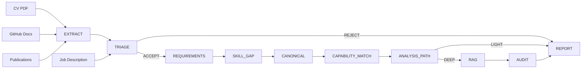
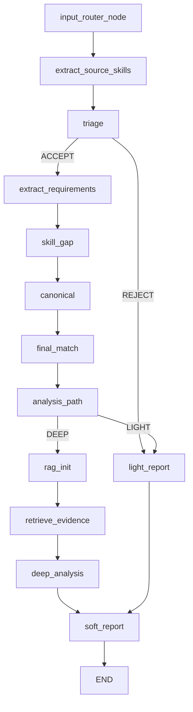

# SkillGap-Graph: Local-First Candidate Assessment Pipeline

A LangGraph-based pipeline designed to evaluate how closely a candidate's profile matches a specific job description.

Unlike standard ATS (Applicant Tracking Systems) that rely heavily on blind keyword overlap, this system combines deterministic matching, semantic reasoning, and retrieval-augmented evidence search. The goal is not just to output a compatibility score, but to generate an explainable assessment report that validates inferred competencies and explicitly identifies missing skills.


> **Status: Experimental / Work in Progress**
>
> This pipeline is fully functional but remains under active development. Due to the reliance on local, smaller-parameter LLMs, you might encounter limitations regarding execution speed and occasional reasoning instability.

---

## The Philosophy Behind the Pipeline

The project was built around three non-negotiable principles: privacy, explainability, and hybrid validation.

To ensure complete data privacy, the entire pipeline is designed to run locally using Ollama. Candidate resumes, GitHub documentation, and job descriptions never leave your machine. While this constraint limits the size of the models we can deploy, it offers a security guarantee that cloud-based alternatives cannot match.

Furthermore, I wanted every decision made by the system to be transparent. Instead of producing an opaque percentage, the pipeline records its reasoning path and exposes the exact document evidence used to support each conclusion. To achieve this reliably, the architecture avoids relying exclusively on semantic reasoning. Exact matching, lexical retrieval, and deterministic validation are heavily integrated alongside LLM processing to anchor the results and minimize hallucinations.

---

## Architectural Decisions & Trade-offs

Building a local-first pipeline requires balancing complexity, resource consumption, and accuracy. 

### Evidence-Validation RAG over Q&A RAG
Traditional Retrieval-Augmented Generation relies on a vector store as a knowledge base to answer questions. This project flips that paradigm. Here, the matching stages generate hypotheses about a candidate's skills, and RAG is subsequently used to search for supporting or contradicting evidence within the provided documents. The vector store acts purely as an evidence collection layer to audit previous conclusions.

### Traditional RAG vs. Vision-Language Models (VLMs)
While VLMs are becoming the standard for complex PDF parsing, I opted for traditional text extraction paired with semantic chunking. Standard RAG provides tighter control over the text chunks fed into the smaller local LLMs. It reduces the memory footprint, limits hallucination risks inherent in small vision models, and keeps the extraction process highly deterministic.

### Extraction Caching with Chroma
Skill extraction is the most expensive bottleneck in the pipeline, requiring a full LLM pass over every source document. To mitigate this during iterative testing, extracted skills are aggressively cached in a dedicated Chroma collection. Each source document is fingerprinted via a content hash; if the source hasn't changed, the pipeline reuses the previously extracted skills. Chroma was chosen over FAISS because its document-oriented model natively supports the metadata filtering (hashes, timestamps, source IDs) required for this caching layer.


---

## How It Works
The pipeline is organized into four major phases.

### Information Extraction (Parallel Execution)
The first phase focuses on information extraction. The orchestration layer is implemented with LangGraph, leveraging conditional edges, parallel execution through Send, and state reducers to coordinate the different analysis stages. Candidate data sources (CVs, GitHub docs, publications) are transformed into structured skill inventories. This stage heavily leverages LangGraph's parallel execution model. By utilizing the `Send` API and state reducers (e.g., `operator.add`), each candidate source is processed independently and asynchronously, then seamlessly merged back into the shared graph state. This allows the pipeline to scale naturally as new evidence sources are introduced without bottlenecking execution.

### Requirement Analysis and Matching
The second phase performs requirement analysis. Job requirements are extracted and compared against the candidate profile through a combination of deterministic matching and semantic reasoning. After the initial matching stage, skills are canonicalized into two complementary representations. Retrieval tokens are optimized for lexical search and evidence discovery, while semantic tags provide higher-level conceptual signals used during reasoning and retrieval fallback. This separation allows lexical search and semantic matching to evolve independently without coupling retrieval behavior to reasoning abstractions.

### Evidence Validation
The third phase is responsible for evidence validation. Skills that cannot be confidently validated during the initial matching stage become retrieval targets. Relevant snippets are collected from the candidate corpus through a cascading lexical-to-semantic retrieval strategy. Unlike traditional semantic matching systems, retrieval does not directly contribute to the initial classification. Instead, it acts as an auditing layer capable of confirming, refining, or even overturning earlier match hypotheses.

### Scoring Model
The final score is not based on raw keyword counts. Each requirement is classified into one of four categories (Direct Match, Semantic Match, Partial, Missing), each contributing a different weight to the overall assessment. When Deep Analysis is enabled, evidence-based audits can further refine the initial classification before the final score is computed.

### Report Generation
The final phase generates the assessment report, combining technical findings, evidence-backed validations, and behavioral requirement analysis.

---

## Architecture

### High-Level Flow



### LangGraph Workflow
<details>
<summary>Click to expand the detailed node workflow</summary>


</details>

---

## Example Output
Behavioral requirements (like "Growth Mindset" or "English Fluency") are evaluated separately from technical requirements and provide a qualitative context without inflating the technical score.

A typical terminal report looks like this:

```text
Match Score: 50%

[ Technical Assessment ]
Cloud Computing       -> PARTIAL (Evidence found regarding pipelines, but cloud infrastructure unconfirmed)
SQL Proficiency       -> DIRECT_MATCH (Explicitly stated in CV)
Redshift              -> MISSING 

[ Behavioral Assessment ]
Analytical Mindset    -> PROBABLE
Growth Mindset        -> NO EVIDENCE
English Fluency       -> FOUND

Execution time: 8m 45s
```

---

## Installation and Setup
Requirements:
- Python 3.12+
- Ollama installed and running locally
- uv

#### Install dependencies
```bash
uv sync
```

#### Pull the required local models
```bash
ollama pull llama3.2:3b
ollama pull llama3.1:8b
ollama pull nomic-embed-text
```

---

## Usage Examples
Run the pipeline by passing candidate materials as arguments. If you don't provide a job description file, the script will prompt you to paste it via standard input.

Evaluate a CV alongside a GitHub documentation folder:
```bash
uv run python -m main \
  --cv data_directory/my_cv.pdf \
  --github data_directory/github_directory/
```

Evaluate a CV alongside a folder of publications:
```bash
uv run python -m main \
  --cv data_directory/my_cv.pdf \
  --publications data_directory/publications
```
---

## Current Limitations and Roadmap
Because the system relies heavily on multiple structured LLM calls, execution on CPU-only machines can take anywhere from 8 to 12 minutes, depending on cache hits.

Additionally, working with local 3B and 8B parameter models introduces probabilistic quirks. Even with the temperature set to zero, you might occasionally encounter slight reasoning instability or false-positive retrievals (e.g., retrieving a snippet about "data pipelines" when searching for specific "Cloud Computing" evidence).

The current implementation relies on terminal-based tracing and graph decision logs. Production-grade observability has intentionally been deferred until the architecture stabilizes.

Upcoming improvements include:
- Merging compatible graph nodes to reduce the total number of LLM calls and speed up execution.
- Refining the canonicalization heuristics to improve retrieval precision for generic skills.
- Expanding soft-skill evaluations using alternative data sources.

---

## License

This project is licensed under the MIT License.

See the LICENSE file for details.
